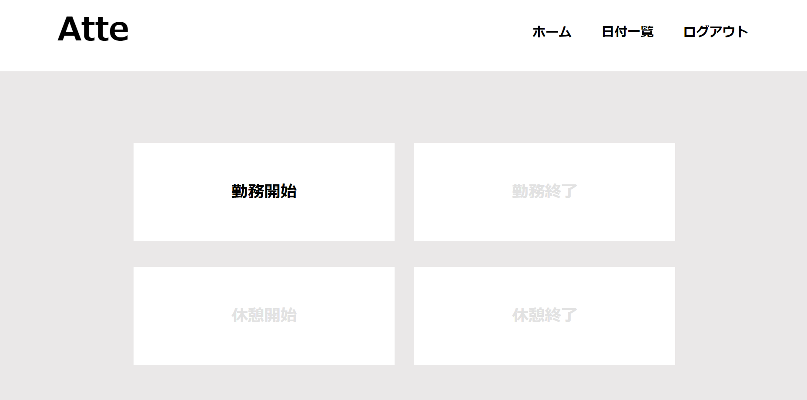
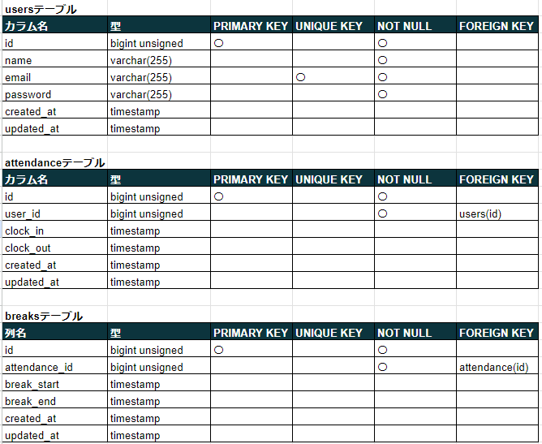
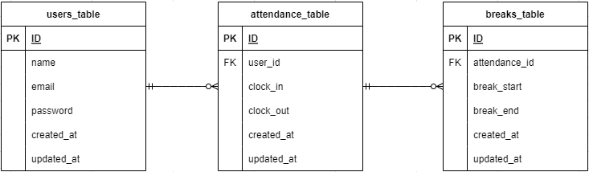

# Atte
本アプリは登録されている会員の勤怠管理を行うアプリです。
勤務開始・終了時刻と休憩開始・終了時刻を記録し、日付ごとに会員の勤怠情報を一覧にして確認することができます。

## 作成した目的
本アプリが作成された背景には、勤怠情報がしっかりと管理されていないために人事評価が適切に行われていなかったことがあります。
そのため、本アプリの目的は、勤怠情報を管理できるようにすることで人事評価を適切に行うことです。

## アプリケーションのURL
アプリケーションのURL：http://localhost/
phpMyAdminのURL：http://localhost:8080/

環境構築後にログインする際は、以下の管理者用のメールアドレスとパスワードをご利用ください。
メールアドレス：test@example.com
パスワード：test1234

## 他のリポジトリ

## 機能一覧
・会員登録
・ログイン
・ログアウト
・勤務開始
・勤務終了
・休憩開始
・休憩終了
・日付別勤怠情報取得（ページネーション）

## 使用技術
・Laravel 8.8
・php 7.4.9
・MySQL 8.0

## テーブル設計

## ER図

## 環境構築
Docker ビルド
1.git clone リンク：https://github.com/aki-369/attendance-management.git
2.docker-compose up -d --build

※MySQlはOSによって起動しない場合があるので、それぞれの PC に合わせて「docker-compose.yml」ファイルを編集してください。

Laravel 環境構築
1.docker-compose exec php bash
2.composer install
3.「.env.example」ファイルから「.env」 を作成し、環境変数を構築
4.php artisan key:generate
5.php artisan migrate
6.php artisan db:seed